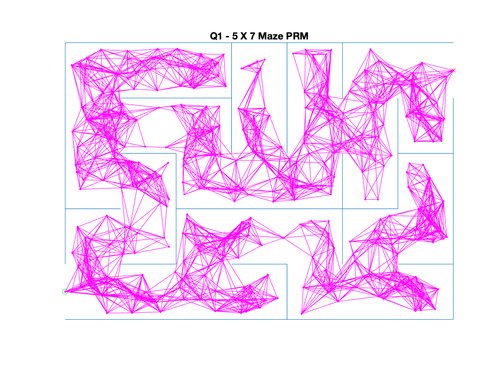
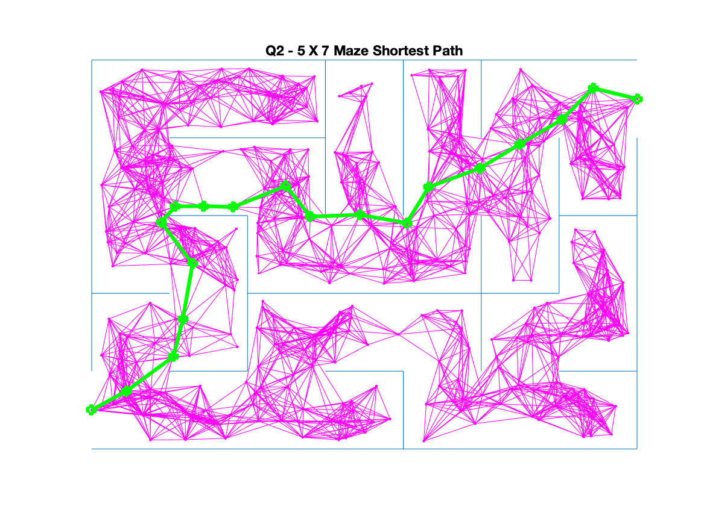
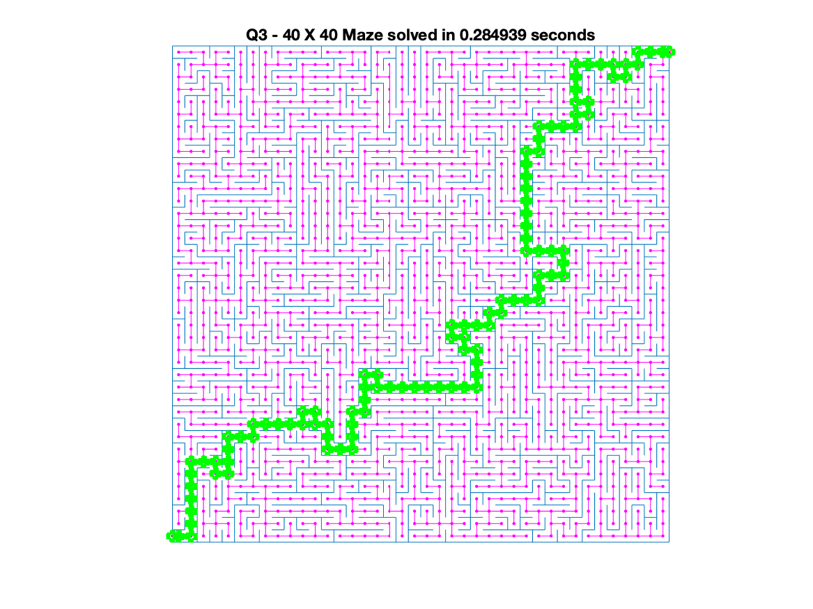
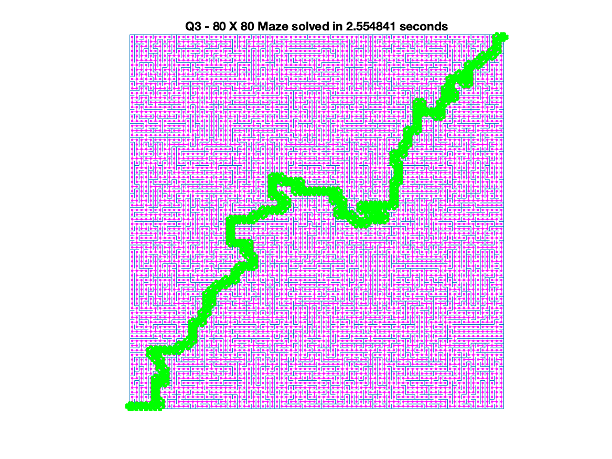
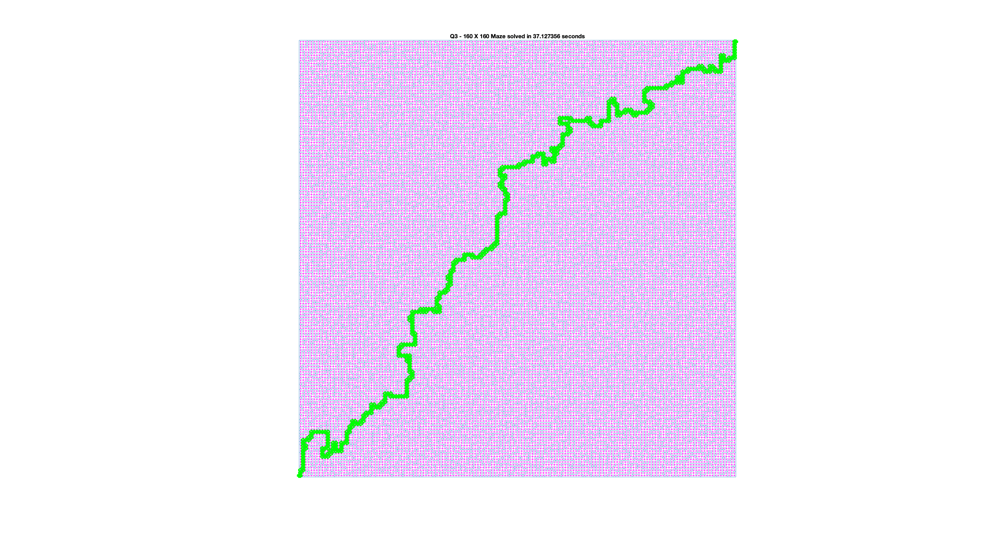

# ROB521 Assignment 1

## How to run the code

`ROB521_assignment1.m` contains all of the code for this assignment, other files contained in this zip are trivially modified. The code is broken into 4 sections: 
1. clear and set rng
2. maze generation, question 1
3. question 2
4. question 3

The code is run using MATLAB 2019b. Open MATLAB and run each section separately. 

## Qeustion 1


There are 500 points generated before removing ones too close to a wall, with 8 nearest neighbors connected with an edge. 

It is observed that generating the maze, generating the points, and generating the edges doesn't take much time. But detecting whether edges collide with a wall does take majority of the time. This is likely because for each edge, we are traversing all the walls that make up the maze and detecting collision, essentially an O(n^2) algorithm. 

## Question 2


An A* search is implemented with euclidean distance as heuristic. The search itself also runs pretty quickly and the path found is quite good. The more points generated, the better the path becomes as more "short cuts" are available. Similarly, increasing the number of nearest neighbor edges also improve the solution, but at a heavy computational cost though. 

## Question 3


For a maze size of 40x40, using random points isn't really feasible, as a very large number of points are needed to have a high likelihood of a path exists. Even for 25x25 maps, it takes a long time on my computer to detect edge collisions. 

The main optimization done in this section is to exploit the fact that all walls of the maze are either vertical or horrizontal, and thus a grid of points can be generated instead of randomly. This drastically reduces the number of points required, and also make connecting the nearest edges a lot easier. With a grid of points, all edges are constrained to be either horizonal or vertical as well, which allows clever optimization to be done on detecting whether edges collide with a wall. Further, the manhattan distance is used as a heuristic. All edges have a length of one, which also speeds up computation as all calculations can be done with integers instead of floating points. 

With these optimizations, the main bottleneck of the maze is no longer to detect edge collisions when finding edges, neither is the finding the best path. Based on several rounds of testing, it seems like constructing the maze and plotting the maze becomes the main bottleneck for working with larger mazes. I've also tried maze sizes of 80 and 160, results as follows:




## Code
```
% ======
% ROB521_assignment1.m
% ======
%
% This assignment will introduce you to the idea of motion planning for  
% holonomic robots that can move in any direction and change direction of 
% motion instantaneously.  Although unrealistic, it can work quite well for
% complex large scale planning.  You will generate mazes to plan through 
% and employ the PRM algorithm presented in lecture as well as any 
% variations you can invent in the later sections.
% 
% There are three questions to complete (5 marks each):
%
%    Question 1: implement the PRM algorithm to construct a graph
%    connecting start to finish nodes.
%    Question 2: find the shortest path over the graph by implementing the
%    Dijkstra's or A* algorithm.
%    Question 3: identify sampling, connection or collision checking 
%    strategies that can reduce runtime for mazes.
%
% Fill in the required sections of this script with your code, run it to
% generate the requested plots, then paste the plots into a short report
% that includes a few comments about what you've observed.  Append your
% version of this script to the report.  Hand in the report as a PDF file.
%
% requires: basic Matlab, 
%
% S L Waslander, January 2022
%
clear; close all; clc;

% set random seed for repeatability if desired
rng(1);
%%
% ==========================
% Maze Generation
% ==========================
%
% The maze function returns a map object with all of the edges in the maze.
% Each row of the map structure draws a single line of the maze.  The
% function returns the lines with coordinates [x1 y1 x2 y2].
% Bottom left corner of maze is [0.5 0.5], 
% Top right corner is [col+0.5 row+0.5]
%

row = 5; % Maze rows
col = 7; % Maze columns
map = maze(row,col); % Creates the maze
start = [0.5, 1.0]; % Start at the bottom left
finish = [col+0.5, row]; % Finish at the top right

h = figure(1);clf; hold on;
plot(start(1), start(2),'go')
plot(finish(1), finish(2),'rx')
show_maze(map,row,col,h); % Draws the maze
drawnow;

% ======================================================
% Question 1: construct a PRM connecting start and finish
% ======================================================
%
% Using 500 samples, construct a PRM graph whose milestones stay at least 
% 0.1 units away from all walls, using the MinDist2Edges function provided for 
% collision detection.  Use a nearest neighbour connection strategy and the 
% CheckCollision function provided for collision checking, and find an 
% appropriate number of connections to ensure a connection from  start to 
% finish with high probability.


% variables to store PRM components
nS = 500;  % number of samples to try for milestone creation
milestones = [start; finish];  % each row is a point [x y] in feasible space
edges = [];  % each row is should be an edge of the form [x1 y1 x2 y2]

disp("Time to create PRM graph")
tic;
% ------insert your PRM generation code here-------
max_dist = col^2 + row^2 + 10;  % upper bound of edge length, add 10 to be conservative
n_nearest = 8;      % for each point, the 8 nearest neighbors will be connected to it

% generating milestones, +0.1 is for the constraint of points not being too
% close to wall
points_x = rand([nS 1]) * (col - 0.1 * 2) + 0.5 + 0.1;
points_y = rand([nS 1]) * (row - 0.1 * 2) + 0.5 + 0.1;

temp_milestones = [points_x points_y];
n_points = length(temp_milestones);

% add milestones only if they are more than 0.1 away from a wall
for i=1:n_points
    if MinDist2Edges([temp_milestones(i, :)], map) >= 0.1 
        milestones = [milestones ; temp_milestones(i, :)];
    end
end

n_points = length(milestones);  % the number of points total

% generate a matrix of distances between any 2 pairs of points
distances = zeros([n_points n_points]);
for i=1:n_points
    for j=1:n_points
        diff = milestones(i, :) - milestones(j, :);
        distances(i, j) = diff * diff';
    end
    distances(i, i) = max_dist;
end

% finding the closest edges
for i=1:n_points
    for j=1:n_nearest
        % find the minimum distance
        [val, idx] = min(distances(i, :));
        temp_edge = [milestones(i, :) milestones(idx, :)];
        
        % remove the already selected edge from the distance matrix
        distances(i, idx) = max_dist;
        distances(idx, i) = max_dist;
        
        % check for edge collision
        collide = 0;
        for k=1:length(map)
            collide = collide | EdgeCollision(temp_edge, map(k, :), 0.1);
        end
        if ~collide
            edges = [edges ; temp_edge];    % add edge to edges
        end
    end
end

% ------end of your PRM generation code -------
toc;

figure(1);
plot(milestones(:,1),milestones(:,2),'m.');
if (~isempty(edges))
    line(edges(:,1:2:3)', edges(:,2:2:4)','Color','magenta') % line uses [x1 x2 y1 y2]
end
str = sprintf('Q1 - %d X %d Maze PRM', row, col);
title(str);
drawnow;

print -dpng assignment1_q1.png

%%
% =================================================================
% Question 2: Find the shortest path over the PRM graph
% =================================================================
%
% Using an optimal graph search method (Dijkstra's or A*) , find the 
% shortest path across the graph generated.  Please code your own 
% implementation instead of using any built in functions.

disp('Time to find shortest path');
tic;

% Variable to store shortest path
spath = []; % shortest path, stored as a milestone row index sequence


% ------insert your shortest path finding algorithm here-------

% generate distance matrix to store distance between all pairs of points
distances = zeros([n_points n_points]);
for i=1:length(edges)
    p1 = edges(i, 1:2);
    p2 = edges(i, 3:4);
    
    % find the index of these points
    idx1 = find(milestones(:, 1) == p1(1) & milestones(:, 2) == p1(2));
    idx2 = find(milestones(:, 1) == p2(1) & milestones(:, 2) == p2(2));
    
    % compute euclidean distance and store to matrix
    diff = p1 - p2;
    distances(idx1, idx2) = diff * diff';
    distances(idx2, idx1) = diff * diff';
end

% compute the "cost-to-go" heuristic as euclidean distance to finish for
% each point
sqr_diff = (milestones - finish).^2;
heuristic = sqrt(sqr_diff(:, 1) + sqr_diff(:, 2));

% initialize score for each point, this score = cost-to-get-here +
% cost-to-go
score = zeros([n_points 1]) + max_dist * 999;
score(1) = 0;   % starting point score is 0
prev_pts = zeros([n_points 1]); % an array to store what is the predecessor of a point
queue = [1];    % the priority queue

% begin A* search
while ~isempty(queue)
    % extract first element from queue
    cur = queue(1); 
    queue(1) = [];
    
    % finish if we reach the finish point, cur=1 means the starting point,
    % cur=2 means the finish point
    if cur == 2
        break
    end
    
    % we need to explore connected paths to this point, distance not equal
    % to zero means two points are connected
    next_pts = find(distances(cur, :) ~= 0);
    cur_score = score(cur);
    for pts=next_pts
        s = cur_score + heuristic(pts);
        if score(pts) > s       % only add the new point in queue if the new score is better than the previous score
            score(pts) = s;
            prev_pts(pts) = cur;
            queue = [queue ; pts];
        end
    end
    
    % sorting the queue to ensure that the best points are explored first
    queue = unique(queue);
    queue = sortrows([score(queue) queue]);
    queue = queue(:, 2);
end

if isempty(queue)
    disp('failed to find path')
end

% building the best path by starting from the finish point and find its
% predecessor
cur = 2;
while cur ~= 1
    spath = [cur spath];
    cur = prev_pts(cur);
end
spath = [1 spath];  % add the start point in

% ------end of shortest path finding algorithm------- 
toc;    

% plot the shortest path
figure(1);
for i=1:length(spath)-1
    plot(milestones(spath(i:i+1),1),milestones(spath(i:i+1),2), 'go-', 'LineWidth',3);
end
str = sprintf('Q2 - %d X %d Maze Shortest Path', row, col);
title(str);
drawnow;

print -dpng assingment1_q2.png

%%
% ================================================================
% Question 3: find a faster way
% ================================================================
%
% Modify your milestone generation, edge connection, collision detection 
% and/or shortest path methods to reduce runtime.  What is the largest maze 
% for which you can find a shortest path 19from start to goal in under 20 
% seconds on your computer? (Anything larger than 40x40 will suffice for 
% full marks)


row = 80;
col = 80;

map = maze(row,col);
start = [0.5, 1.0];
finish = [col+0.5, row];
milestones = [start; finish];  % each row is a point [x y] in feasible space
edges = [];  % each row is should be an edge of the form [x1 y1 x2 y2]

disp('plotting maze')

h = figure(2);clf; hold on;
plot(start(1), start(2),'go')
plot(finish(1), finish(2),'rx')
show_maze(map,row,col,h); % Draws the maze
drawnow;

fprintf("Attempting large %d X %d maze... \n", row, col);
tic;        
% ------insert your optimized algorithm here------
max_dist = row + col;   % upper bound, used to compute scores

% generating a grid of points and extracting their coordinates
[points_x, points_y] = meshgrid(linspace(1, col, col)', linspace(1, row, row)');
points_x = reshape(points_x, [], 1);
points_y = reshape(points_y, [], 1);

milestones = [milestones ; [points_x points_y]];
n_points = length(milestones);

% connecting milestones by looping through each point, only connecting it
% to the point on the right and the point on top to prevent redundant edges
disp('generating edges')
for i=1:col
    for j=1:row
        temp_edge1 = [i j i+1 j];   % the edge on the right of the point, a horrizonal edge
        
        % horrizontal edge can only collide with a vertical wall, so we can
        % constrain the search for a candidate wall by limiting its x
        % coordinate and set a range on its y coordinate
        map_edge_idx = find(map(:, 1) == map(:, 3) & map(:, 3) == (i+0.5) & map(:, 2) < j & map(:, 4) > j)';
        % check if candidate walls collide with the edge
        collide = 0;
        for l=map_edge_idx
            if EdgeCollision(temp_edge1, map(l, :), 0.1)
                collide = 1;
                break
            end
        end
        if ~collide
            edges = [edges ; temp_edge1];
        end
        
        temp_edge2 = [i j i j+1];   % the edge on the top of the point, a vertical edge
        
        % similarly, vertical edge can only collide with a horrizontal
        % wall, this allows us to constrain its y coordinate and a range of
        % x coordinates
        map_edge_idx = find(map(:, 2) == map(:, 4) & map(:, 4) == (j+0.5) & map(:, 1) < i & map(:, 3) > i)';
        % check if candidate walls collide with the edge
        collide = 0;
        for l=map_edge_idx
            if EdgeCollision(temp_edge2, map(l, :), 0.1)
                collide = 1;
                break
            end
        end
        if ~collide
            edges = [edges ; temp_edge2];
        end
    end
    i
end

% add 2 additional edges that connect the start and the finish points
edges(length(edges), :) = [];
edges = [edges ; [start 1 1] ; [row col finish]];


% toc
% plot(milestones(:,1),milestones(:,2),'m.');
% if (~isempty(edges))
%     line(edges(:,1:2:3)', edges(:,2:2:4)','Color','magenta') % line uses [x1 x2 y1 y2]
% end
% str = sprintf('Q1 - %d X %d Maze PRM', row, col);
% title(str);
% drawnow;
disp('starting path search')

% generate distance matrix between every pairs of points
spath = [];
distances = zeros([n_points n_points]);
for i=1:length(edges)
    p1 = edges(i, 1:2);
    p2 = edges(i, 3:4);
    idx1 = find(milestones(:, 1) == p1(1) & milestones(:, 2) == p1(2));
    idx2 = find(milestones(:, 1) == p2(1) & milestones(:, 2) == p2(2));
    
    % this time using manhattan distance, since all edges are either
    % vertical or horizontal
    diff = p1 - p2;
    distances(idx1, idx2) = diff(1) + diff(2);
    distances(idx2, idx1) = diff(1) + diff(2);
end

% compute cost-to-go heuristic for every point using manhattan distance
diff = finish - milestones;
heuristic = diff(:, 1) + diff(:, 2);

% initializa score matrix for each point
score = zeros([n_points 1]) + max_dist * 999;
score(1) = 0;
prev_pts = zeros([n_points 1]); % store predecessors of points
queue = [1];

% the same A* search as before
while ~isempty(queue)
    cur = queue(1);
    queue(1) = [];
    if cur == 2
        break
    end
    next_pts = find(distances(cur, :) ~= 0);
    cur_score = score(cur);
    for pts=next_pts
        s = cur_score + heuristic(pts);
        if score(pts) > s
            score(pts) = s;
            prev_pts(pts) = cur;
            queue = [queue ; pts];
        end
    end
    if isempty(queue)
        break
    end
    queue = unique(queue);
    queue = sortrows([score(queue) queue]);
    queue = queue(:, 2);
end

% build the optimal path
disp('path search complete')
if isempty(queue)
    disp('failed to find path')
    while cur ~= 1
        spath = [cur spath];
        cur = prev_pts(cur);
    end
    spath = [1 spath];
else
    while cur ~= 1
        spath = [cur spath];
        cur = prev_pts(cur);
    end
    spath = [1 spath];
end


% ------end of your optimized algorithm-------
dt = toc;
disp('plotting optimal path')
h = figure(2);clf; hold on;
plot(start(1), start(2),'go')
plot(finish(1), finish(2),'rx')
show_maze(map,row,col,h); % Draws the maze
drawnow;
plot(milestones(:,1),milestones(:,2),'m.');
if (~isempty(edges))
    line(edges(:,1:2:3)', edges(:,2:2:4)','Color','magenta')
end
if (~isempty(spath))
    for i=1:length(spath)-1
        plot(milestones(spath(i:i+1),1),milestones(spath(i:i+1),2), 'go-', 'LineWidth',3);
    end
end
str = sprintf('Q3 - %d X %d Maze solved in %f seconds', row, col, dt);
title(str);

print -dpng assignment1_q3.png


```
